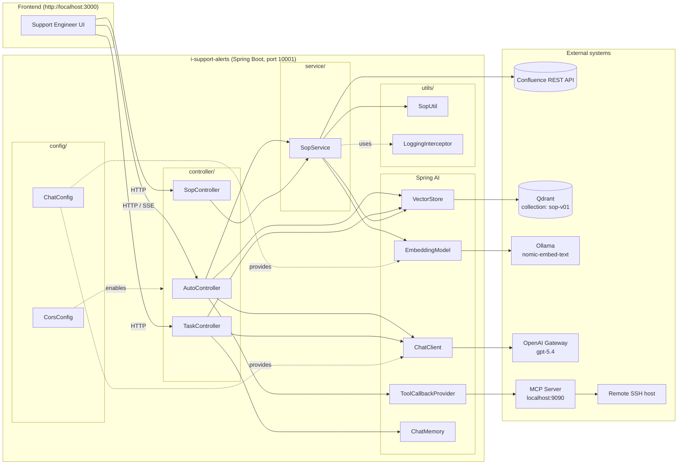

# Component Diagram

High-level view of how Spring components, external systems, and AI infrastructure interact.

```mermaid
flowchart LR
    subgraph Client["Frontend (http://localhost:3000)"]
        UI[Support Engineer UI]
    end

    subgraph App["i-support-alerts (Spring Boot, port 10001)"]
        direction TB
        subgraph Controllers["controller/"]
            AC[AutoController]
            SC[SopController]
            TC[TaskController]
        end
        subgraph Services["service/"]
            SS[SopService]
        end
        subgraph Config["config/"]
            CC[ChatConfig]
            CORS[CorsConfig]
        end
        subgraph Utils["utils/"]
            SU[SopUtil]
            LI[LoggingInterceptor]
        end
        subgraph SpringAI["Spring AI"]
            CCl[ChatClient]
            EM[EmbeddingModel]
            VS[VectorStore]
            TCB[ToolCallbackProvider]
            CM[ChatMemory]
        end
    end

    subgraph External["External systems"]
        CONF[(Confluence REST API)]
        QD[(Qdrant<br/>collection: sop-v01)]
        OLL[Ollama<br/>nomic-embed-text]
        OAI[OpenAI Gateway<br/>gpt-5.4]
        MCP[MCP Server<br/>localhost:9090]
        SSH[Remote SSH host]
    end

    UI -->|HTTP / SSE| AC
    UI -->|HTTP| SC
    UI -->|HTTP| TC

    AC --> CCl
    AC --> VS
    AC --> SS
    AC --> TCB
    SC --> SS
    TC --> CCl
    TC --> VS
    TC --> CM

    SS --> CONF
    SS --> SU
    SS --> EM
    SS --> VS
    SS -.uses.-> LI

    CC -. provides .-> CCl
    CC -. provides .-> EM
    CORS -. enables .-> Controllers

    EM --> OLL
    CCl --> OAI
    VS --> QD
    TCB --> MCP
    MCP --> SSH
```
