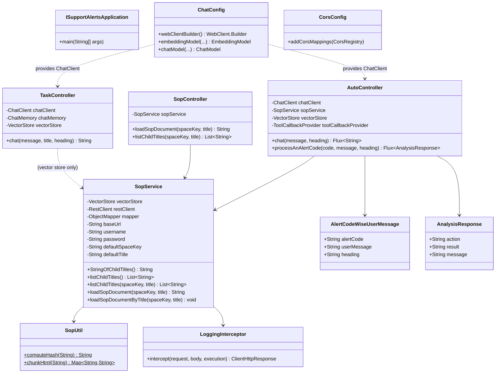

# Class Diagram

Key classes, their fields, and relationships.

```mermaid
classDiagram
    class ISupportAlertsApplication {
        +main(String[] args)
    }

    class AutoController {
        -ChatClient chatClient
        -SopService sopService
        -VectorStore vectorStore
        -ToolCallbackProvider toolCallbackProvider
        +chat(message, heading) Flux~String~
        +processAnAlertCode(code, message, heading) Flux~AnalysisResponse~
    }

    class SopController {
        -SopService sopService
        +loadSopDocument(spaceKey, title) String
        +listChildTitles(spaceKey, title) List~String~
    }

    class TaskController {
        -ChatClient chatClient
        -ChatMemory chatMemory
        -VectorStore vectorStore
        +chat(message, title, heading) String
    }

    class SopService {
        -VectorStore vectorStore
        -RestClient restClient
        -ObjectMapper mapper
        -String baseUrl
        -String username
        -String password
        -String defaultSpaceKey
        -String defaultTitle
        +StringOfChildTitles() String
        +listChildTitles() List~String~
        +listChildTitles(spaceKey, title) List~String~
        +loadSopDocument(spaceKey, title) String
        +loadSopDocumentByTitle(spaceKey, title) void
    }

    class ChatConfig {
        +webClientBuilder() WebClient.Builder
        +embeddingModel(...) EmbeddingModel
        +chatModel(...) ChatModel
    }

    class CorsConfig {
        +addCorsMappings(CorsRegistry)
    }

    class SopUtil {
        +computeHash(String) String$
        +chunkHtml(String) Map~String,String~$
    }

    class LoggingInterceptor {
        +intercept(request, body, execution) ClientHttpResponse
    }

    class AlertCodeWiseUserMessage {
        +String alertCode
        +String userMessage
        +String heading
    }

    class AnalysisResponse {
        +String action
        +String result
        +String message
    }

    AutoController --> SopService
    AutoController --> AlertCodeWiseUserMessage
    AutoController --> AnalysisResponse
    SopController --> SopService
    TaskController ..> SopService : (vector store only)
    SopService --> SopUtil
    SopService --> LoggingInterceptor
    ChatConfig ..> AutoController : provides ChatClient
    ChatConfig ..> TaskController : provides ChatClient
```
