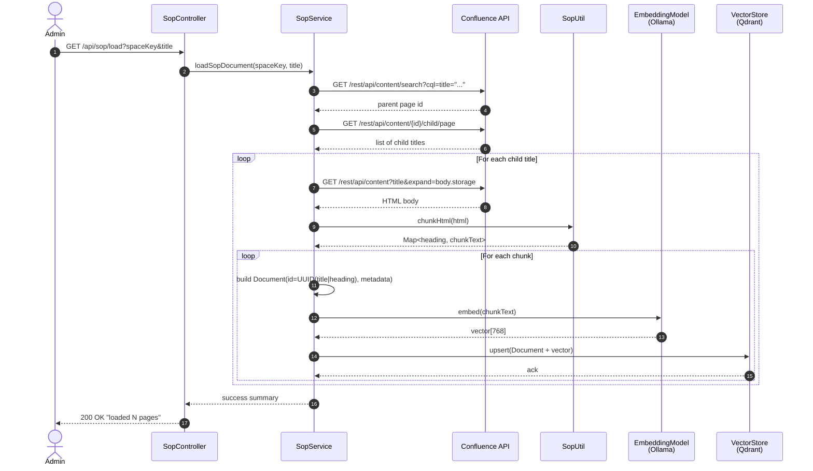
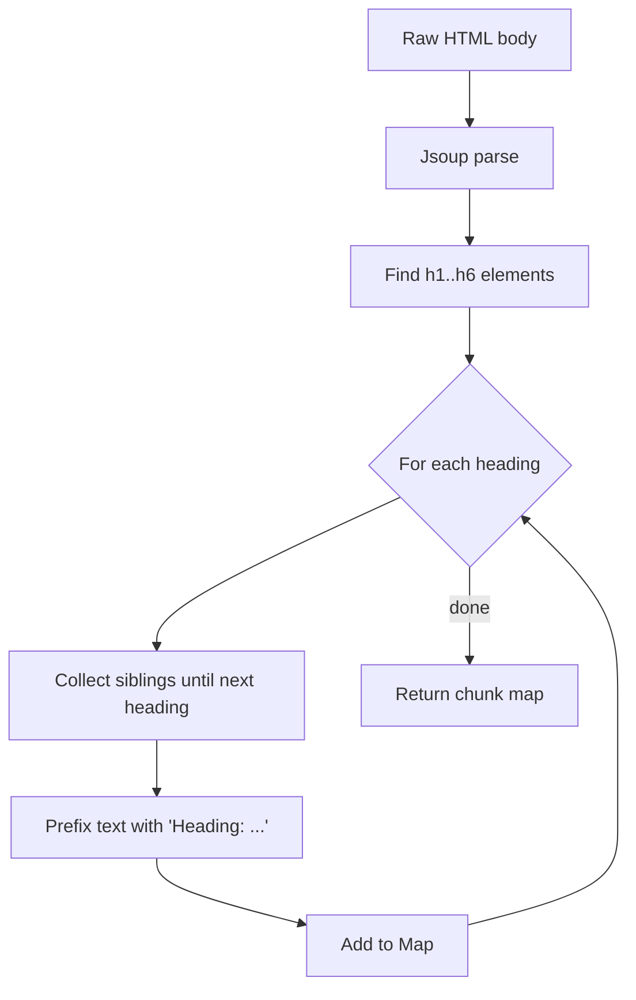

# SOP Load Flow

Sequence for ingesting Confluence SOP pages into Qdrant.

```mermaid
sequenceDiagram
    autonumber
    actor Admin
    participant SC as SopController
    participant SS as SopService
    participant CONF as Confluence API
    participant SU as SopUtil
    participant EM as EmbeddingModel<br/>(Ollama)
    participant VS as VectorStore<br/>(Qdrant)

    Admin->>SC: GET /api/sop/load?spaceKey&title
    SC->>SS: loadSopDocument(spaceKey, title)
    SS->>CONF: GET /rest/api/content/search?cql=title="..."
    CONF-->>SS: parent page id
    SS->>CONF: GET /rest/api/content/{id}/child/page
    CONF-->>SS: list of child titles

    loop For each child title
        SS->>CONF: GET /rest/api/content?title&expand=body.storage
        CONF-->>SS: HTML body
        SS->>SU: chunkHtml(html)
        SU-->>SS: Map<heading, chunkText>
        loop For each chunk
            SS->>SS: build Document(id=UUID(title|heading), metadata)
            SS->>EM: embed(chunkText)
            EM-->>SS: vector[768]
            SS->>VS: upsert(Document + vector)
            VS-->>SS: ack
        end
    end

    SS-->>SC: success summary
    SC-->>Admin: 200 OK "loaded N pages"
```

## Chunking detail (`SopUtil.chunkHtml`)

```mermaid
flowchart TD
    A[Raw HTML body] --> B[Jsoup parse]
    B --> C[Find h1..h6 elements]
    C --> D{For each heading}
    D --> E[Collect siblings until next heading]
    E --> F[Prefix text with 'Heading: ...']
    F --> G[Add to Map<chunkId, chunkText>]
    G --> D
    D -->|done| H[Return chunk map]
```
