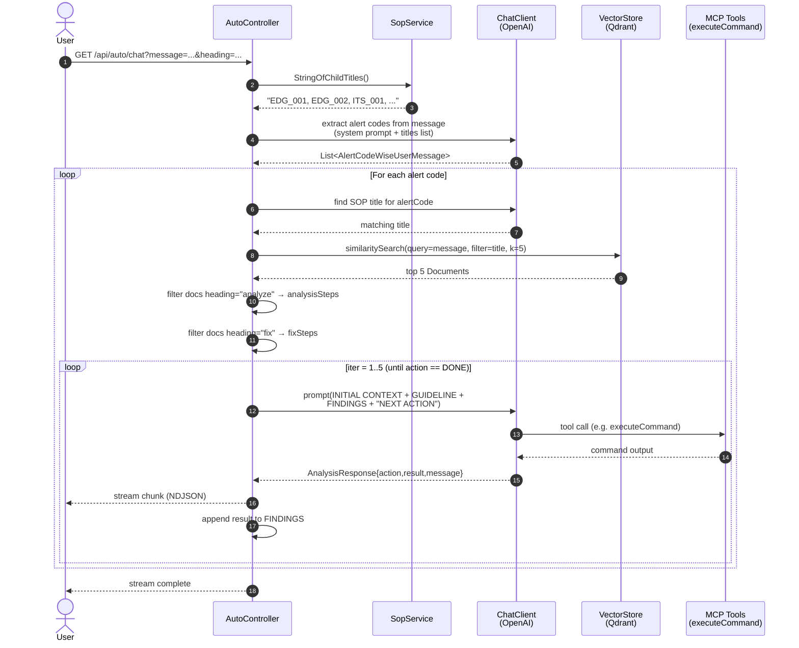
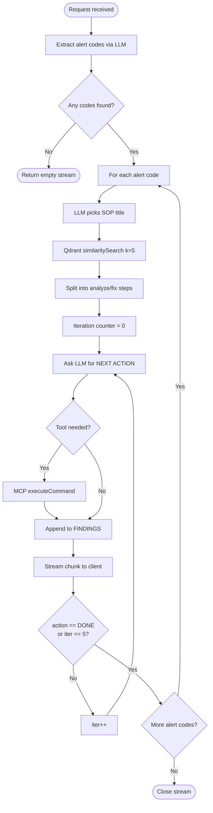

# Auto Chat Flow (`/api/auto/chat`)

End-to-end flow for the iterative alert analysis endpoint that streams results via NDJSON.

```mermaid
sequenceDiagram
    autonumber
    actor User
    participant AC as AutoController
    participant SS as SopService
    participant CCl as ChatClient<br/>(OpenAI)
    participant VS as VectorStore<br/>(Qdrant)
    participant MCP as MCP Tools<br/>(executeCommand)

    User->>AC: GET /api/auto/chat?message=...&heading=...
    AC->>SS: StringOfChildTitles()
    SS-->>AC: "EDG_001, EDG_002, ITS_001, ..."

    AC->>CCl: extract alert codes from message<br/>(system prompt + titles list)
    CCl-->>AC: List<AlertCodeWiseUserMessage>

    loop For each alert code
        AC->>CCl: find SOP title for alertCode
        CCl-->>AC: matching title

        AC->>VS: similaritySearch(query=message, filter=title, k=5)
        VS-->>AC: top 5 Documents

        AC->>AC: filter docs heading="analyze" → analysisSteps
        AC->>AC: filter docs heading="fix"     → fixSteps

        loop iter = 1..5  (until action == DONE)
            AC->>CCl: prompt(INITIAL CONTEXT + GUIDELINE +<br/>FINDINGS + "NEXT ACTION")
            CCl->>MCP: tool call (e.g. executeCommand)
            MCP-->>CCl: command output
            CCl-->>AC: AnalysisResponse{action,result,message}
            AC-->>User: stream chunk (NDJSON)
            AC->>AC: append result to FINDINGS
        end
    end

    AC-->>User: stream complete
```

## Decision flowchart

```mermaid
flowchart TD
    Start([Request received]) --> Parse[Extract alert codes via LLM]
    Parse --> HasCodes{Any codes found?}
    HasCodes -- No --> EndNo([Return empty stream])
    HasCodes -- Yes --> Loop[For each alert code]
    Loop --> FindTitle[LLM picks SOP title]
    FindTitle --> RAG[Qdrant similaritySearch k=5]
    RAG --> Split[Split into analyze/fix steps]
    Split --> Iter[Iteration counter = 0]
    Iter --> Ask[Ask LLM for NEXT ACTION]
    Ask --> Tool{Tool needed?}
    Tool -- Yes --> Exec[MCP executeCommand]
    Exec --> Findings[Append to FINDINGS]
    Tool -- No --> Findings
    Findings --> Stream[Stream chunk to client]
    Stream --> Done{action == DONE<br/>or iter == 5?}
    Done -- No --> Inc[iter++]
    Inc --> Ask
    Done -- Yes --> Next{More alert codes?}
    Next -- Yes --> Loop
    Next -- No --> EndOk([Close stream])
```
