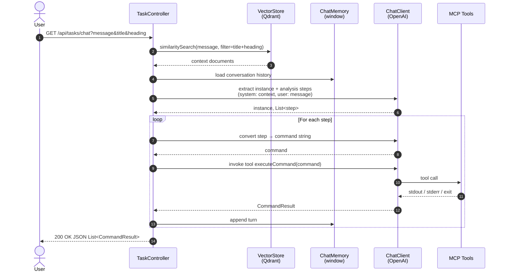

# Task Chat Flow (`/api/tasks/chat`)

Sequence for the task-oriented endpoint that turns SOP steps into shell commands and runs them via MCP.

```mermaid
sequenceDiagram
    autonumber
    actor User
    participant TC as TaskController
    participant VS as VectorStore<br/>(Qdrant)
    participant CM as ChatMemory<br/>(window)
    participant CCl as ChatClient<br/>(OpenAI)
    participant MCP as MCP Tools

    User->>TC: GET /api/tasks/chat?message&title&heading
    TC->>VS: similaritySearch(message, filter=title+heading)
    VS-->>TC: context documents
    TC->>CM: load conversation history

    TC->>CCl: extract instance + analysis steps<br/>(system: context, user: message)
    CCl-->>TC: instance, List<step>

    loop For each step
        TC->>CCl: convert step → command string
        CCl-->>TC: command
        TC->>CCl: invoke tool executeCommand(command)
        CCl->>MCP: tool call
        MCP-->>CCl: stdout / stderr / exit
        CCl-->>TC: CommandResult
        TC->>CM: append turn
    end

    TC-->>User: 200 OK JSON List<CommandResult>
```
