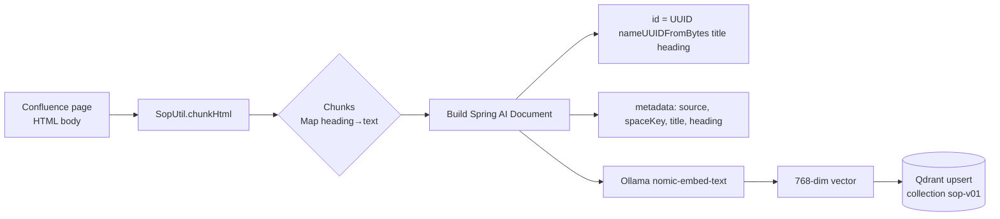
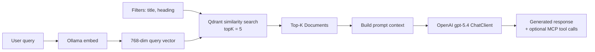

# RAG Pipeline

How documents flow from Confluence into Qdrant, and how queries are answered.

## Indexing pipeline

## Retrieval pipeline

## Document schema in Qdrant

| Field | Description |
|---|---|
| `id` | Deterministic UUID from `title|heading` (idempotent upserts) |
| `vector` | 768-dim embedding from `nomic-embed-text` |
| `payload.text` | `Heading: <h>\n<chunk content>` |
| `payload.metadata.source` | `confluence` |
| `payload.metadata.spaceKey` | Confluence space key |
| `payload.metadata.title` | Confluence page title |
| `payload.metadata.heading` | Section heading within the page |
