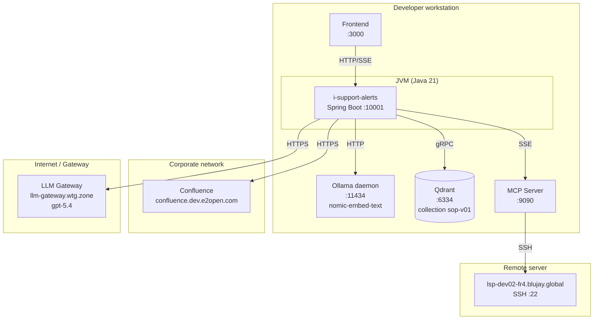

# Deployment Diagram

Runtime topology of all moving pieces.

## Port summary

| Service | Port | Protocol |
|---|---|---|
| i-support-alerts | 10001 | HTTP |
| Frontend | 3000 | HTTP |
| Ollama | 11434 | HTTP |
| Qdrant | 6334 | gRPC |
| MCP server | 9090 | SSE/HTTP |
| Remote SSH | 22 | SSH |
