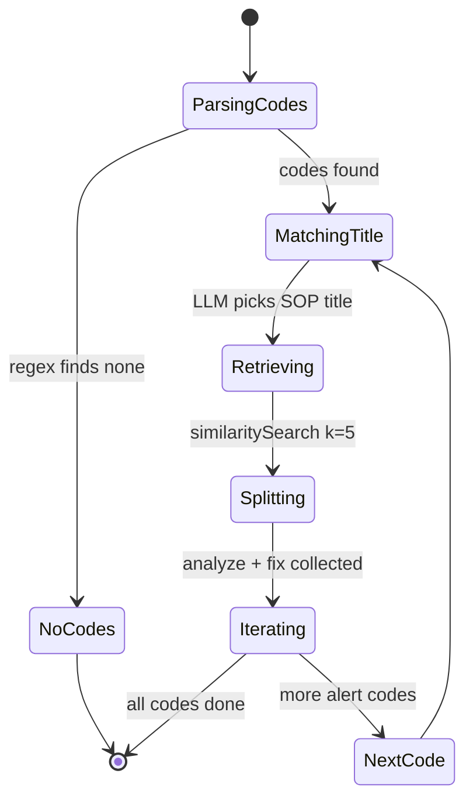
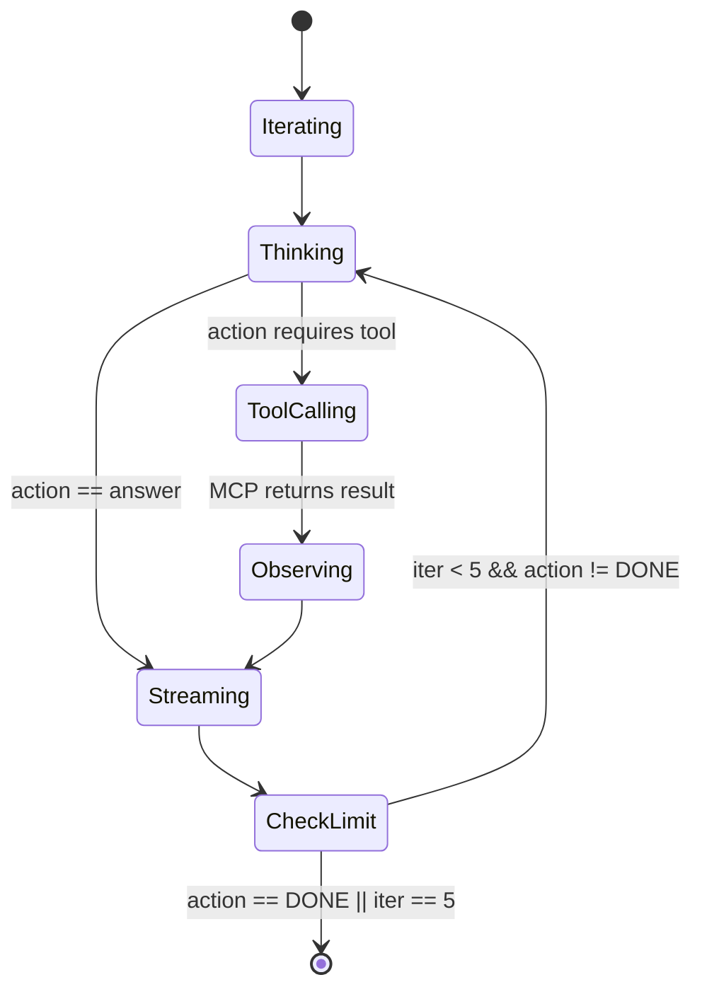

# State Diagram — Auto Chat iteration loop

The iterative reasoning loop inside `AutoController.processAnAlertCode()`.

## 1. Main flow

```mermaid
stateDiagram-v2
    [*] --> ParsingCodes
    ParsingCodes --> NoCodes: regex finds none
    ParsingCodes --> MatchingTitle: codes found
    NoCodes --> [*]

    MatchingTitle --> Retrieving: LLM picks SOP title
    Retrieving --> Splitting: similaritySearch k=5
    Splitting --> Iterating: analyze + fix collected

    Iterating --> NextCode: more alert codes
    NextCode --> MatchingTitle
    Iterating --> [*]: all codes done
```

## 2. Iteration loop (expansion of `Iterating`)

```mermaid
stateDiagram-v2
    [*] --> Iterating
    Iterating --> Thinking
    Thinking --> ToolCalling: action requires tool
    Thinking --> Streaming: action == answer
    ToolCalling --> Observing: MCP returns result
    Observing --> Streaming
    Streaming --> CheckLimit
    CheckLimit --> Thinking: iter < 5 && action != DONE
    CheckLimit --> [*]: action == DONE || iter == 5
```
